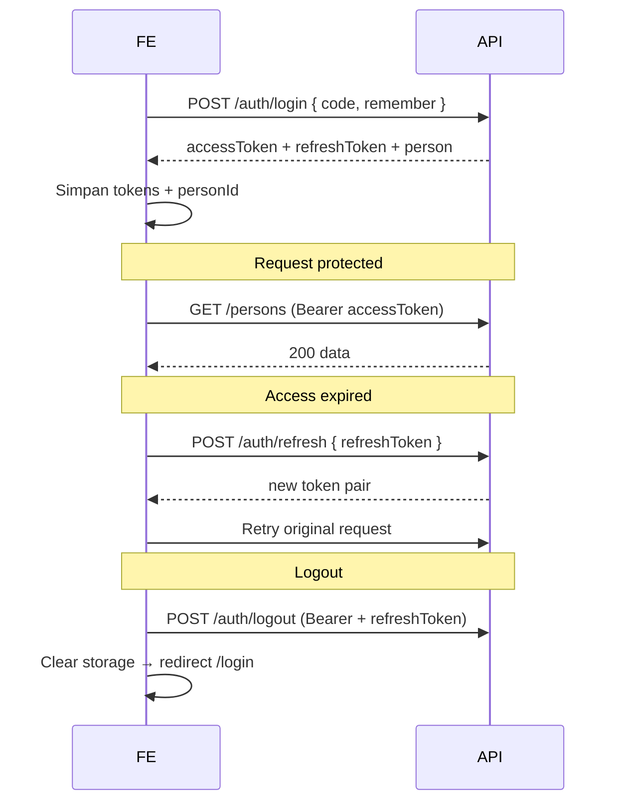

# FamilyRoots — Panduan Integrasi API (Frontend)

Dokumen ini untuk tim **Frontend** mulai mengganti mock lokal dengan API backend yang sudah tersedia sampai fitur **family tree graph**.

**Base URL (dev):** `http://localhost:3000`  
**Prefix API:** `/api/v1`  
**Postman:** import `postman/FamilyRoots-API.postman_collection.json`

---

## Daftar isi

1. [Yang sudah tersedia di BE](#1-yang-sudah-tersedia-di-be)
2. [Setup FE lokal](#2-setup-fe-lokal)
3. [Kontrak response](#3-kontrak-response)
4. [Auth — login, token, session](#4-auth--login-token-session)
5. [Persons — list, pagination, tree](#5-persons--list-pagination-tree)
6. [Tree graph — cara render di FE](#6-tree-graph--cara-render-di-fe)
7. [Persons CRUD](#7-persons-crud)
8. [Logs (opsional)](#8-logs-opsional)
9. [TypeScript types (copy ke FE)](#9-typescript-types-copy-ke-fe)
10. [API client — contoh implementasi](#10-api-client--contoh-implementasi)
11. [Migrasi dari mock FE](#11-migrasi-dari-mock-fe)
12. [Checklist implementasi](#12-checklist-implementasi)
13. [Akun demo & smoke test](#13-akun-demo--smoke-test)

---

## 1. Yang sudah tersedia di BE

| Modul | Endpoint | Auth |
|---|---|---|
| Health | `GET /api/v1/health` | Public |
| Auth | `POST /auth/login`, `/refresh`, `/logout`, `GET /auth/me` | Mixed |
| Persons | `GET/POST /persons`, `GET/PUT/DELETE /persons/:id` | Bearer required |
| Logs | `POST /logs/events` | Optional Bearer |

**Belum ada:** self-register, upload foto, endpoint tree nested khusus, admin login-code hint.

---

## 2. Setup FE lokal

### Environment variable FE

```env
VITE_API_BASE_URL=http://localhost:3000/api/v1
```

### CORS (backend `.env`)

Pastikan origin FE diizinkan:

```env
# Vite default
CORS_ORIGINS=http://localhost:5173

# atau dev bebas (jangan di production)
CORS_ORIGINS=*
```

Backend BE harus jalan:

```bash
cd family-tree-api
npm run db:setup   # pertama kali
npm run dev        # http://localhost:3000
```

### Response headers (tracing)

| Header | Nilai | Kegunaan FE |
|---|---|---|
| `X-Request-Id` | UUID per request | Kirim ke support / log FE saat error |
| `X-API-Version` | `v1` | Versioning |

---

## 3. Kontrak response

### Sukses

Semua endpoint sukses membungkus payload di `data`:

```json
{ "data": { ... } }
```

### Error

```json
{
  "error": {
    "code": "CODE_NOT_FOUND",
    "message": "Kode tidak ditemukan. Periksa singkatan nama dan tanggal lahir Anda."
  }
}
```

Pesan selalu **Bahasa Indonesia**. Handle berdasarkan `error.code`, bukan parse `message`.

### Kode error yang relevan FE

| HTTP | `code` | Kapan |
|---|---|---|
| 400 | `CODE_REQUIRED` | Login tanpa kode |
| 400 | `CODE_INVALID_FORMAT` | Format kode salah |
| 400 | `REFRESH_TOKEN_REQUIRED` | Refresh tanpa body |
| 400 | `PERSON_VALIDATION_FAILED` | CRUD person invalid |
| 400 | `TREE_FILTER_INVALID` | Query filter tree tidak valid |
| 400 | `INVALID_LOG_EVENT` | Payload log salah |
| 401 | `CODE_NOT_FOUND` | Kode tidak cocok / person deceased |
| 401 | `UNAUTHORIZED` | Token invalid / expired |
| 401 | `REFRESH_TOKEN_INVALID` | Refresh expired / revoked |
| 403 | `PERSON_READ_FOCUS_FORBIDDEN` | `focusPersonId` bukan diri sendiri / pasangan |
| 403 | `CORS_FORBIDDEN` | Origin tidak diizinkan |
| 404 | `PERSON_NOT_FOUND` | Person tidak ada di family |
| 404 | `NOT_FOUND` | Route tidak ada |
| 429 | `TOO_MANY_ATTEMPTS` | Rate limit login (10/IP/15 menit) |
| 500 | `INTERNAL_ERROR` | Server error |

---

## 4. Auth — login, token, session

### Login code (sama dengan mock FE)

Format: `{SINGKATAN_NAMA}{DDMMYY}` — contoh `MIA210399`, `MR170845`.

**Singkatan selalu dari `fullName` saja** — field `nickname` tidak mempengaruhi login code (hanya untuk UI).

Aturan singkatan **identik** dengan `src/utils/loginCode.ts` di FE. BE derive kode dari DB, tidak simpan plaintext.

Input: `trim` → UPPERCASE → hapus spasi. Max **40** karakter.

Hanya person `status === "alive"` boleh login.

### `POST /api/v1/auth/login`

**Public** — tidak perlu Bearer.

```http
POST /api/v1/auth/login
Content-Type: application/json

{
  "code": "MIA210399",
  "remember": false
}
```

**200 OK**

```json
{
  "data": {
    "accessToken": "eyJ...",
    "refreshToken": "opaque-random-string",
    "expiresIn": 3600,
    "person": {
      "id": 83,
      "fullName": "Mochamad Irfani Ardhyansah",
      "nickname": null,
      "gender": "male",
      "birthDate": "1999-03-21",
      "status": "alive",
      "photoUrl": null,
      "isMarried": true,
      "isLegal": true,
      "spouseIds": [84]
    }
  }
}
```

| Field | Catatan FE |
|---|---|
| `expiresIn` | Detik — access token TTL (default 3600) |
| `remember` | `true` → refresh TTL 30 hari; `false` → 1 hari |
| `person.id` | Simpan sebagai `userId` / `personId` |
| `isMarried` | `true` jika punya pasangan aktif di `person_spouses` |
| `isLegal` | `true` jika usia **di atas 17 tahun** (≥ 18, birthday sudah lewat) |
| `spouseIds` | ID pasangan — untuk pivot pohon (fokus ke diri vs pasangan). Kosong `[]` jika belum menikah |

### Penyimpanan token (rekomendasi)

| Token | `remember=false` | `remember=true` |
|---|---|---|
| `accessToken` | memory / sessionStorage | memory / sessionStorage |
| `refreshToken` | sessionStorage | localStorage |

Ganti session mock (`familyroots_auth`, `familyroots_auth_user`) dengan pasangan token di atas.

### `GET /api/v1/auth/me`

**Protected** — `Authorization: Bearer <accessToken>`

```json
{
  "data": {
    "id": 83,
    "fullName": "Mochamad Irfani Ardhyansah",
    "nickname": null,
    "gender": "male",
    "birthDate": "1999-03-21",
    "status": "alive",
    "photoUrl": null,
    "isMarried": true,
    "isLegal": true,
    "spouseIds": [84],
    "familyId": 1
  }
}
```

Field `isMarried`, `isLegal`, `spouseIds` sama seperti response login.

Pakai saat app boot / refresh halaman untuk restore session.

**Pivot pohon (FE):** jika `isMarried`, tawarkan anchor `person.id` (diri) atau `spouseIds[0]` (pasangan utama).

### `POST /api/v1/auth/refresh`

**Public** — kirim refresh token di body (rotation: token lama invalid setelah sukses).

```json
{ "refreshToken": "..." }
```

**200 OK**

```json
{
  "data": {
    "accessToken": "eyJ...",
    "refreshToken": "new-opaque-token",
    "expiresIn": 3600
  }
}
```

Implementasi FE: interceptor 401 → coba refresh sekali → retry request → jika gagal, logout.

### `POST /api/v1/auth/logout`

**Protected** + body refresh token (opsional tapi disarankan):

```json
{ "refreshToken": "..." }
```

**200 OK:** `{ "data": { "loggedOut": true } }`

Hapus token di client setelah sukses.

### Alur auth FE (diagram)



---

## 5. Persons — list, pagination, tree

Semua endpoint persons **wajib auth**. Data otomatis scoped ke `familyId` dari JWT.

### Perbedaan penting

| Field | Arti |
|---|---|
| `isSelf` | Person = user yang login (highlight UI) — dari `selfPersonId` di tree |
| `isFocus` | Person = `focusPersonId` pivot saat ini |
| `focusPersonId` | Pivot baca / center pohon — dari query param atau default login |
| `selfPersonId` | User login (JWT) — hanya di response `?view=tree` |
| `allowedFocusPersonIds` | ID valid untuk param: diri + pasangan |
| `rootPersonId` | Mode **list**: config anchor keluarga di DB. Mode **tree**: sama dengan `focusPersonId` |
| `generationLabel` | Label relatif ke `focusPersonId` — **dihitung BE** |
| `role` | `"admin"` \| `"member"` — dari `family_members` |

### Query `focusPersonId` — **semua GET read**

Satu param, satu validasi (middleware), untuk **semua** endpoint baca persons:

| Endpoint | Contoh |
|---|---|
| List | `GET /persons?page=1&focusPersonId=84` |
| Tree | `GET /persons?view=tree&focusPersonId=84` |
| Detail | `GET /persons/49?focusPersonId=83` |

- Default (param di-skip) → `focusPersonId` = user login
- Hanya boleh ID **diri sendiri** atau **pasangan** (`spouseIds` dari login)
- Response **selalu** include top-level `focusPersonId` + `allowedFocusPersonIds`
- **`generationLabel`** dihitung relatif ke `focusPersonId`
- **`isSelf`** = user login (`selfPersonId`); **`isFocus`** = person pivot
- **List & detail** difilter ke **cabang genealogi** fokus: leluhur + keturunan + node pasangan (tanpa expand ke bloodline orang tua pasangan)
- **Tree (v1):** mengembalikan **semua person aktif** — tanpa filter params
- **Tree (v2):** kirim filter params → BE return **subgraph** (selaras `filterPersons()` di `treeLayout.ts`)
- `meta.recommendClientFilter` → `true` jika family ≥ 200 person; FE auto-switch ke v2
- `pagination.total` (list) = jumlah person **dalam cabang**, bukan seluruh keluarga

### ⚠️ ID bertipe `number`

Mock FE mungkin pakai `id: string`. API mengembalikan **integer**. Update type & state FE.

---

### Mode A — List paginated (tabel / admin)

```http
GET /api/v1/persons?page=1&limit=20&focusPersonId=84
Authorization: Bearer <accessToken>
```

| Query | Default | Max |
|---|---|---|
| `page` | `1` | — |
| `limit` | `20` | `100` |

**200 OK**

```json
{
  "data": {
    "focusPersonId": 83,
    "allowedFocusPersonIds": [83, 84],
    "view": "list",
    "rootPersonId": 83,
    "persons": [ /* max `limit` items */ ],
    "pagination": {
      "page": 1,
      "limit": 20,
      "total": 95,
      "totalPages": 5,
      "hasNext": true,
      "hasPrev": false
    }
  }
}
```

**UI suggestion:** infinite scroll atau numbered pagination pakai `hasNext` / `hasPrev`.

---

### Mode B — Tree graph (full atau subgraph)

```http
GET /api/v1/persons?view=tree
GET /api/v1/persons?view=tree&focusPersonId=84
GET /api/v1/persons?view=tree&focusPersonId=83&lineage=paternal&generationsUp=4
GET /api/v1/persons?view=tree&focusPersonId=83&lineage=both&generationsUp=4&showSpouses=true&showSiblings=true&showChildren=true
Authorization: Bearer <accessToken>
```

| Query | Default | Validasi |
|---|---|---|
| `focusPersonId` | user login (JWT) | Hanya **diri sendiri** atau **pasangan** |

**Subgraph filter (v2 — semua opsional):**

| Param | Default saat aktif | Deskripsi |
|---|---|---|
| `lineage` | `both` | `both` \| `paternal` \| `maternal` |
| `generationsUp` | `4` | Integer 1–12 |
| `showSpouses` | `false` | Pasangan node segaris |
| `showSiblings` | `false` | Saudara kandung + leluhur (≤ buyut) |
| `showChildren` | `false` | 1 generasi anak |

Tanpa filter params → **full tree** (~95 di seed). Dengan filter params → subgraph.

**200 OK — full tree**

```json
{
  "data": {
    "view": "tree",
    "focusPersonId": 84,
    "selfPersonId": 83,
    "allowedFocusPersonIds": [83, 84],
    "rootPersonId": 84,
    "persons": [ /* all active persons */ ],
    "treeGraph": {
      "anchorPersonId": 84,
      "edgeFields": {
        "parent": ["fatherId", "motherId"],
        "spouse": "spouseIds"
      }
    },
    "filter": {
      "lineage": "both",
      "generationsUp": 4,
      "showSpouses": false,
      "showSiblings": false,
      "showChildren": false,
      "applied": false
    },
    "meta": {
      "personCount": 95,
      "totalFamilyCount": 95,
      "maxAncestorDepth": 6,
      "filtered": false,
      "recommendClientFilter": false
    },
    "graphWarnings": []
  }
}
```

**200 OK — subgraph**

```json
{
  "data": {
    "view": "tree",
    "focusPersonId": 83,
    "selfPersonId": 83,
    "rootPersonId": 83,
    "persons": [ /* subgraph */ ],
    "filter": {
      "lineage": "paternal",
      "generationsUp": 4,
      "showSpouses": false,
      "showSiblings": false,
      "showChildren": false,
      "applied": true
    },
    "meta": {
      "personCount": 28,
      "totalFamilyCount": 95,
      "maxAncestorDepth": 4,
      "filtered": true,
      "recommendClientFilter": false
    },
    "graphWarnings": []
  }
}
```

| Field tree | Arti |
|---|---|
| `filter.applied` | `false` = full; `true` = subgraph aktif |
| `meta.totalFamilyCount` | Ukuran family sebelum filter |
| `meta.recommendClientFilter` | FE disarankan pakai filter params jika ≥ 200 |

**Error filter:** `400 TREE_FILTER_INVALID`

**Error fokus:** `403 PERSON_READ_FOCUS_FORBIDDEN`

**Kapan pakai:**

| Halaman FE | Endpoint |
|---|---|
| `/tree`, visualisasi pohon | `?view=tree&focusPersonId=` (opsional) |
| Daftar anggota / search table | `?page=&limit=` |
| Detail satu orang | `GET /persons/:id` |

Jangan pakai list paginated untuk render pohon — relasi parent/spouse bisa terpotong.

---

### Shape satu `Person`

```json
{
  "id": 83,
  "fullName": "Mochamad Irfani Ardhyansah",
  "nickname": null,
  "gender": "male",
  "birthDate": "1999-03-21",
  "deathDate": null,
  "status": "alive",
  "religion": "islam",
  "photoUrl": null,
  "occupation": "Software Engineer",
  "phone": "+6281234567890",
  "phoneAlt": null,
  "address": {
    "street": "Jl. Example No. 1",
    "district": "Lowokwaru",
    "city": "Malang",
    "province": "Jawa Timur",
    "postalCode": "65141",
    "country": "Indonesia",
    "latitude": null,
    "longitude": null
  },
  "fatherId": 12,
  "motherId": 13,
  "spouseIds": [84],
  "generationLabel": "Kamu",
  "isSelf": true,
  "role": "admin"
}
```

| Field nullable | Catatan |
|---|---|
| `nickname`, `deathDate`, `religion`, `photoUrl`, … | Bisa `null` |
| `address` | `null` jika tidak ada alamat |
| `fatherId`, `motherId` | `null` jika tidak diisi |

---

### `GET /api/v1/persons/:id`

Detail satu person — shape person + meta fokus top-level:

```http
GET /api/v1/persons/49?focusPersonId=83
```

```json
{
  "data": {
    "focusPersonId": 83,
    "allowedFocusPersonIds": [83, 84],
    "id": 49,
    "fullName": "H. Budi Ardhyansah",
    "...": "..."
  }
}
```

---

## 6. Tree graph — cara render di FE

BE **tidak** mengirim nested tree. FE bangun graph dari flat list.

### Langkah implementasi

```typescript
// 1. Fetch sekali (ganti focusPersonId saat user pilih diri / pasangan)
const tree = (
  await api.get<PersonListResponse>('/persons?view=tree&focusPersonId=84')
).data;
const { persons, treeGraph, selfPersonId } = tree;

// 2. Index by id
const byId = new Map(persons.map((p) => [p.id, p]));

// 3. Parent edges (directed: child → parent)
function getParents(person: Person): Person[] {
  return [person.fatherId, person.motherId]
    .filter((id): id is number => id != null)
    .map((id) => byId.get(id)!)
    .filter(Boolean);
}

// 4. Spouse edges (undirected)
function getSpouses(person: Person): Person[] {
  return person.spouseIds
    .map((id) => byId.get(id)!)
    .filter(Boolean);
}

// Center layout dari anchorPersonId (= focusPersonId)
const focusId = treeGraph!.anchorPersonId;
const focusNode = byId.get(focusId);
// Highlight login user: person.isSelf (bukan anchor)
const selfNode = byId.get(selfPersonId!);
```

### Visual mapping

| Data API | UI tree |
|---|---|
| `fatherId` / `motherId` | Garis vertikal ke atas (generasi) |
| `spouseIds` | Node horizontal berdampingan |
| `gender` | Slot kiri/kanan layout (opsional) |
| `status === "deceased"` | Style muted / memorial |
| `isSelf === true` | Ring / badge highlight |
| `generationLabel` | Tooltip atau label node |
| `photoUrl`, `fullName` | Avatar + nama node |

### Center tree on user vs focus

| Strategi | Start node |
|---|---|
| Default pohon | `treeGraph.anchorPersonId` (= `focusPersonId`) |
| Highlight login | person dengan `isSelf: true` (`selfPersonId`) |
| Navbar "Pasangan" | refetch `?view=tree&focusPersonId=<spouseId>` |
| Klik node | optional — FE local pan, atau refetch dengan focus baru |

Di mode tree, `rootPersonId` = `focusPersonId` (bukan config DB).

---

## 7. Persons CRUD

Semua butuh Bearer. Validasi error → `400 PERSON_VALIDATION_FAILED`.

### Create — `POST /api/v1/persons`

**201 Created** — return full person object.

```json
{
  "fullName": "Nama Lengkap",
  "nickname": "Panggilan",
  "gender": "male",
  "birthDate": "1990-01-15",
  "deathDate": null,
  "status": "alive",
  "religion": "islam",
  "photoUrl": null,
  "occupation": null,
  "phone": null,
  "phoneAlt": null,
  "address": {
    "street": "Jl. ...",
    "city": "Malang",
    "province": "Jawa Timur",
    "country": "Indonesia"
  },
  "fatherId": 12,
  "motherId": 13,
  "spouseIds": [84],
  "role": "member"
}
```

| Field | Required |
|---|---|
| `fullName`, `gender`, `birthDate` | ✅ |
| Lainnya | Opsional |

### Update — `PUT /api/v1/persons/:id`

Kirim shape yang sama (full replace fields yang divalidasi BE).

### Delete — `DELETE /api/v1/persons/:id`

Soft delete. **200:** `{ "data": { "deleted": true } }`

**403** jika user hapus diri sendiri yang juga `rootPersonId`.

---

## 8. Logs (opsional)

Tracking navigasi FE — auth **opsional** (jika Bearer ada, `actor_person_id` terisi).

```http
POST /api/v1/logs/events
Content-Type: application/json
Authorization: Bearer <accessToken>   # optional

{
  "action": "page.view",
  "path": "/tree",
  "label": "Family Tree",
  "metadata": { "referrer": "/dashboard" }
}
```

| `action` | Keterangan |
|---|---|
| `page.view` | Halaman dibuka |
| `click` | Interaksi UI |

**201:** `{ "data": { "recorded": true } }`

Saran: fire-and-forget dari router FE, jangan block UI.

---

## 9. TypeScript types (copy ke FE)

```typescript
// src/types/api.ts

export type ApiSuccess<T> = { data: T };
export type ApiError = { error: { code: string; message: string } };

export type Gender = 'male' | 'female';
export type PersonStatus = 'alive' | 'deceased';
export type PersonRole = 'admin' | 'member';

export type PersonAddress = {
  street?: string | null;
  district?: string | null;
  city?: string | null;
  province?: string | null;
  postalCode?: string | null;
  country?: string | null;
  latitude?: number | null;
  longitude?: number | null;
};

export type Person = {
  id: number;
  fullName: string;
  nickname: string | null;
  gender: Gender;
  birthDate: string;
  deathDate: string | null;
  status: PersonStatus;
  religion: 'islam' | 'other' | null;
  photoUrl: string | null;
  occupation: string | null;
  phone: string | null;
  phoneAlt: string | null;
  address: PersonAddress | null;
  fatherId: number | null;
  motherId: number | null;
  spouseIds: number[];
  generationLabel: string;
  isSelf: boolean;
  isFocus: boolean;
  role: PersonRole;
};

export type PaginationMeta = {
  page: number;
  limit: number;
  total: number;
  totalPages: number;
  hasNext: boolean;
  hasPrev: boolean;
};

export type ReadFocusMeta = {
  focusPersonId: number;
  allowedFocusPersonIds: number[];
};

export type PersonListResponse = ReadFocusMeta & {
  view: 'list' | 'tree';
  selfPersonId?: number;
  rootPersonId: number | null;
  persons: Person[];
  pagination?: PaginationMeta;
  treeGraph?: {
    anchorPersonId: number;
    edgeFields: {
      parent: ['fatherId', 'motherId'];
      spouse: 'spouseIds';
    };
  };
  filter?: {
    lineage: 'both' | 'paternal' | 'maternal';
    generationsUp: number;
    showSpouses: boolean;
    showSiblings: boolean;
    showChildren: boolean;
    applied: boolean;
  };
  meta?: {
    personCount: number;
    totalFamilyCount: number;
    maxAncestorDepth: number;
    filtered: boolean;
    recommendClientFilter: boolean;
  };
  graphWarnings?: string[];
};

export type PersonReadResponse = ReadFocusMeta & Person;

export type AuthPersonSummary = {
  id: number;
  fullName: string;
  nickname: string | null;
  gender: Gender;
  birthDate: string;
  status: PersonStatus;
  photoUrl: string | null;
  isMarried: boolean;
  isLegal: boolean;
  spouseIds: number[];
};

export type LoginResponse = {
  accessToken: string;
  refreshToken: string;
  expiresIn: number;
  person: AuthPersonSummary;
};

export type AuthMeResponse = AuthPersonSummary & { familyId: number };

export type RefreshResponse = {
  accessToken: string;
  refreshToken: string;
  expiresIn: number;
};
```

---

## 10. API client — contoh implementasi

```typescript
// src/lib/apiClient.ts

const BASE = import.meta.env.VITE_API_BASE_URL;

let accessToken: string | null = null;
let refreshToken: string | null = null;

export function setTokens(access: string | null, refresh: string | null) {
  accessToken = access;
  refreshToken = refresh;
}

async function refreshAccessToken(): Promise<boolean> {
  if (!refreshToken) return false;

  const res = await fetch(`${BASE}/auth/refresh`, {
    method: 'POST',
    headers: { 'Content-Type': 'application/json' },
    body: JSON.stringify({ refreshToken }),
  });

  if (!res.ok) return false;

  const json = (await res.json()) as ApiSuccess<RefreshResponse>;
  accessToken = json.data.accessToken;
  refreshToken = json.data.refreshToken;
  // persist to storage...
  return true;
}

export async function apiFetch<T>(
  path: string,
  init: RequestInit = {},
  retry = true,
): Promise<T> {
  const headers = new Headers(init.headers);
  headers.set('Content-Type', 'application/json');
  if (accessToken) headers.set('Authorization', `Bearer ${accessToken}`);

  const res = await fetch(`${BASE}${path}`, { ...init, headers });

  if (res.status === 401 && retry) {
    const refreshed = await refreshAccessToken();
    if (refreshed) return apiFetch<T>(path, init, false);
  }

  const body = await res.json();
  if (!res.ok) throw body as ApiError;
  return (body as ApiSuccess<T>).data;
}
```

### Hook contoh — tree page

```typescript
// src/hooks/useFamilyTree.ts
export function useFamilyTree() {
  return useQuery({
    queryKey: ['persons', 'tree'],
    queryFn: () => apiFetch<Extract<PersonListResponse, { view: 'tree' }>>('/persons?view=tree'),
    staleTime: 5 * 60 * 1000,
  });
}
```

### Hook contoh — person list

```typescript
export function usePersonList(page: number, limit = 20) {
  return useQuery({
    queryKey: ['persons', 'list', page, limit],
    queryFn: () =>
      apiFetch<Extract<PersonListResponse, { view: 'list' }>>(
        `/persons?page=${page}&limit=${limit}`,
      ),
  });
}
```

---

## 11. Migrasi dari mock FE

| Mock lama | Ganti dengan |
|---|---|
| `familyroots_auth` flag | `accessToken` + `refreshToken` |
| `familyroots_auth_user` (string id) | `person.id` number dari login/me |
| Local person array | `GET /persons?view=tree` atau paginated |
| Client-side `generationLabel` | Pakai field dari API (sudah dihitung BE) |
| Client-side `isSelf` compare | Pakai `person.isSelf` dari API |
| `Person.id: string` | `Person.id: number` |
| Mock login validate | `POST /auth/login` |
| Register page | Tetap stub — **tidak ada API register v1** |

### State management suggestion

```
AuthContext
  ├── accessToken, refreshToken
  ├── person: AuthMeResponse | null
  ├── login(code, remember)
  ├── logout()
  └── bootstrap() → GET /auth/me or refresh

TreeContext (atau React Query)
  └── persons tree cache dari ?view=tree

PersonListContext
  └── paginated queries per page
```

Setelah CRUD person sukses, **invalidate** query `['persons']`.

---

## 12. Checklist implementasi

### Fase 1 — Foundation
- [ ] Set `VITE_API_BASE_URL`
- [ ] Buat `apiClient` + error handler (`error.code`)
- [ ] Copy types dari section 9
- [ ] Smoke: `GET /health`

### Fase 2 — Auth
- [ ] Halaman login → `POST /auth/login`
- [ ] Simpan token (`remember` → localStorage vs sessionStorage)
- [ ] Protected route guard (redirect jika 401)
- [ ] App boot → `GET /auth/me` atau refresh
- [ ] Auto refresh on 401
- [ ] Logout → `POST /auth/logout` + clear storage
- [ ] Handle `TOO_MANY_ATTEMPTS` di UI login

### Fase 3 — Persons list
- [ ] Ganti mock list → `GET /persons?page=&limit=`
- [ ] Pagination UI (`hasNext`, `totalPages`)
- [ ] Detail person → `GET /persons/:id`
- [ ] Tampilkan `generationLabel`, `role`, `isSelf`

### Fase 4 — Tree graph
- [ ] Fetch tree dengan `focusPersonId` dari pilihan user (diri / pasangan dari login `spouseIds`)
- [ ] Auto-switch: `meta.recommendClientFilter` → kirim filter params (v2)
- [ ] Full tree (< 200) tanpa filter params; subgraph dengan `lineage`, `generationsUp`, `show*`
- [ ] Build `Map<id, Person>` langsung dari response (skip client `filterPersons` jika `filter.applied`)
- [ ] Render edges: parent + spouse
- [ ] Center dari `treeGraph.anchorPersonId`; highlight dari `isSelf` / `selfPersonId`
- [ ] Style deceased / highlight self
- [ ] Loading & error states

### Fase 5 — Admin CRUD (jika `role === 'admin'`)
- [ ] Create / update / delete person
- [ ] Invalidate cache tree + list setelah mutate
- [ ] Handle `PERSON_DELETE_FORBIDDEN`

### Fase 6 — Observability (opsional)
- [ ] Router hook → `POST /logs/events` page.view
- [ ] Log `X-Request-Id` saat tampilkan error ke user

---

## 13. Akun demo & smoke test

### Akun utama (disarankan untuk dev FE)

| Field | Nilai |
|---|---|
| Login code | **`MIA210399`** |
| Nama | Mochamad Irfani Ardhyansah |
| Nickname | — |
| birthDate | 1999-03-21 |
| Role | admin |
| `isSelf` | true (setelah login) |
| `rootPersonId` | id person "me" (config DB; di tree = `focusPersonId`) |

### Akun lain (seed)

| Code | Person |
|---|---|
| `MR170845` | Mulyono Raka (admin) |
| `BA200175` | H. Budi Ardhyansah (father) |
| `CM121076` | Hj. Citra Maharani (mother) |

### Smoke test manual (curl)

```bash
# 1. Health
curl http://localhost:3000/api/v1/health

# 2. Login
TOKEN=$(curl -s -X POST http://localhost:3000/api/v1/auth/login \
  -H "Content-Type: application/json" \
  -d '{"code":"MIA210399","remember":false}' \
  | jq -r '.data.accessToken')

# 3. Me
curl -s http://localhost:3000/api/v1/auth/me \
  -H "Authorization: Bearer $TOKEN" | jq

# 4. List paginated
curl -s "http://localhost:3000/api/v1/persons?page=1&limit=5" \
  -H "Authorization: Bearer $TOKEN" | jq '.data.pagination'

# 5. Tree full (tanpa filter)
curl -s "http://localhost:3000/api/v1/persons?view=tree&focusPersonId=83" \
  -H "Authorization: Bearer $TOKEN" | jq '.data.meta'

# 6. Tree subgraph — garis ayah
curl -s "http://localhost:3000/api/v1/persons?view=tree&focusPersonId=83&lineage=paternal&generationsUp=4" \
  -H "Authorization: Bearer $TOKEN" | jq '.data | {filter, count: (.persons|length), meta}'

# 7. Tree subgraph — preset lengkap
curl -s "http://localhost:3000/api/v1/persons?view=tree&focusPersonId=83&lineage=both&generationsUp=4&showSpouses=true&showSiblings=true&showChildren=true" \
  -H "Authorization: Bearer $TOKEN" | jq '.data | {filter, count: (.persons|length), meta}'
```

---

## Referensi tambahan

| Dokumen | Isi |
|---|---|
| [`PERSON-API-TREE.md`](./PERSON-API-TREE.md) | Detail pagination & tree graph |
| [`BE-AUTH-API-PLAN.md`](./BE-AUTH-API-PLAN.md) | Rencana BE lengkap + aturan login code |
| [`adr/001-auth-tokens.md`](./adr/001-auth-tokens.md) | JWT payload & refresh rotation |
| [`DATABASE-DESIGN.md`](./DATABASE-DESIGN.md) | Schema DB |
| [`../postman/README.md`](../postman/README.md) | Postman collection |

---

**Pertanyaan ke BE:** jika ada mismatch type atau field missing, sertakan `X-Request-Id` dari response header.
