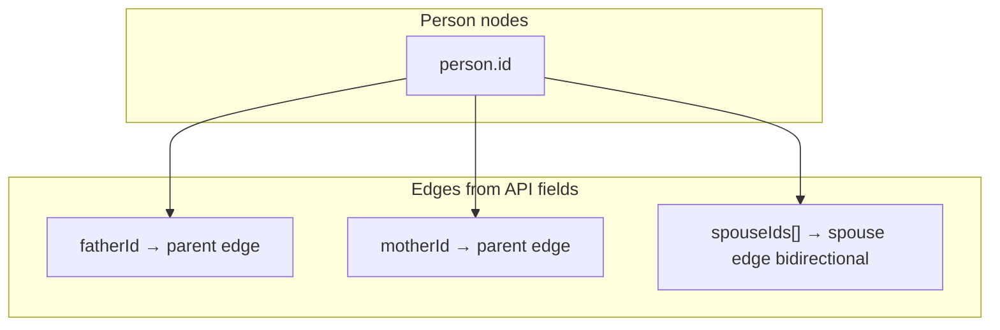

# Person API — List, Pagination & Family Tree Graph

## Dua mode list

| Query | Use case | Pagination |
|---|---|---|
| `GET /api/v1/persons` | Tabel / admin list | **Ya** (default) |
| `GET /api/v1/persons?view=tree` | Render pohon keluarga di FE | **Tidak** — semua node |

### Query params (mode list)

| Param | Default | Max | Deskripsi |
|---|---|---|---|
| `page` | `1` | — | Halaman (1-based) |
| `limit` | `20` | `100` | Item per halaman |

Contoh: `GET /api/v1/persons?page=2&limit=25`

---

## Response — mode list (paginated)

```json
{
  "data": {
    "view": "list",
    "rootPersonId": 83,
    "persons": [ /* slice halaman ini */ ],
    "pagination": {
      "page": 1,
      "limit": 20,
      "total": 95,
      "totalPages": 5,
      "hasNext": true,
      "hasPrev": false
    }
  }
}
```

---

## Response — mode tree (`?view=tree`)

Pohon **tidak** butuh format nested khusus dari BE. FE membangun graph dari **flat list + edge fields**:

```json
{
  "data": {
    "view": "tree",
    "rootPersonId": 83,
    "persons": [ /* semua 95 person */ ],
    "treeGraph": {
      "anchorPersonId": 83,
      "edgeFields": {
        "parent": ["fatherId", "motherId"],
        "spouse": "spouseIds"
      },
      "note": "Bangun adjacency graph di FE. rootPersonId = titik tampilan awal pohon (bukan user login)."
    }
  }
}
```

### Cara FE render tree



1. Fetch **`?view=tree`** sekali saat buka halaman pohon.
2. Index persons by `id` → `Map<number, Person>`.
3. Parent edges: jika `person.fatherId` / `person.motherId` ada, link ke node orang tua.
4. Spouse edges: untuk tiap `spouseId` di `spouseIds`, link dua arah (pasangan).
5. **Anchor layout:** mulai render dari `rootPersonId` (atau `isSelf` person jika ingin center on user).
6. **`generationLabel`** sudah dihitung BE relatif ke user login — pakai untuk label UI.

### Field yang dipakai graph (jangan di-skip)

| Field | Graph role |
|---|---|
| `id` | Node key |
| `fatherId`, `motherId` | Vertical genealogy |
| `spouseIds` | Horizontal partnership |
| `gender` | Layout slot (optional) |
| `status` | Deceased styling |
| `fullName`, `photoUrl` | Node label/avatar |

Field **`isSelf`** = user login (untuk highlight), **`rootPersonId`** = anchor pohon (bisa beda).

---

## Akun demo utama (seed)

| Field | Nilai |
|---|---|
| Nama | Mochamad Irfani Ardhyansah |
| Nickname | Kamu |
| birthDate | 1999-03-21 |
| Login code | **KAMU210399** |
| Role | admin |

Setelah ubah seed: `npm run seed` (atau update manual row `me` di DB).
