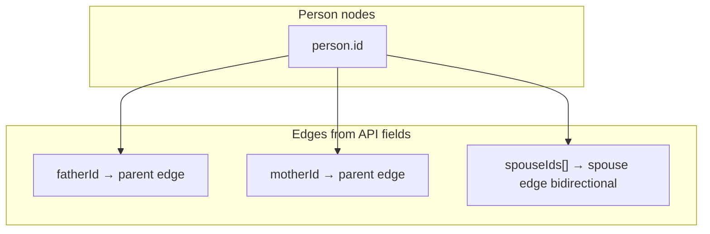

# Person API — List, Pagination & Family Tree Graph

## Query `focusPersonId` (semua GET read)

Param **`focusPersonId`** berlaku untuk **semua endpoint baca** persons:

| Endpoint | Contoh |
|---|---|
| `GET /api/v1/persons` | `?page=1&focusPersonId=84` |
| `GET /api/v1/persons?view=tree` | `?view=tree&focusPersonId=84` |
| `GET /api/v1/persons/:id` | `?focusPersonId=84` |

Validasi (middleware `resolveReadFocusMiddleware`):
- Default = user login (JWT)
- Hanya boleh **diri sendiri** atau **pasangan** terdaftar
- `403 PERSON_READ_FOCUS_FORBIDDEN` jika ID lain
- `404 PERSON_NOT_FOUND` jika ID tidak ada di family

**Filter cabang (list & detail):** `GET /persons` (mode list) dan `GET /persons/:id` hanya mengembalikan person dalam cabang `focusPersonId`:
- Leluhur (naik via `fatherId` / `motherId`)
- Keturunan (turun)
- Pasangan dari node di bloodline (node saja — **tidak** include leluhur pasangan)

**Mode tree (v1 — full):** tanpa filter params → **semua person aktif** di family.

**Mode tree (v2 — subgraph):** dengan filter params opsional → BE return subgraph terfilter (selaras FE `filterPersons()`). FE family besar (≥200) disarankan pakai filter params; lihat `meta.recommendClientFilter`.

Contoh pivot ke istri: di **list**, data ayah/ibu kamu **tidak** muncul; di **tree full**, semua node tetap ada — label generasi dihitung relatif ke istri.

Response **selalu** menyertakan (top-level):

```json
{
  "focusPersonId": 84,
  "allowedFocusPersonIds": [83, 84]
}
```

---

## Dua mode list

| Query | Use case | Pagination |
|---|---|---|
| `GET /api/v1/persons` | Tabel / admin list | **Ya** (default) |
| `GET /api/v1/persons?view=tree` | Render pohon keluarga di FE | **Tidak** — full atau subgraph |
| `GET /api/v1/persons?view=tree&focusPersonId=84` | Pohon dengan pivot pasangan | Validasi via middleware |
| `GET /api/v1/persons?view=tree&...&lineage=paternal&...` | Subgraph terfilter (v2) | Lihat filter params |

### Query params (mode list)

| Param | Default | Max | Deskripsi |
|---|---|---|---|
| `page` | `1` | — | Halaman (1-based) |
| `limit` | `20` | `100` | Item per halaman |

### Query params (mode tree — existing)

| Param | Default | Validasi |
|---|---|---|
| `focusPersonId` | user login (JWT) | Hanya **diri sendiri** atau **pasangan** |

### Query params (mode tree — subgraph filter v2, semua opsional)

**Jika tidak ada param filter → full tree (backward compatible v1).**  
Jika **satu atau lebih** param filter dikirim → subgraph; param yang di-skip memakai default di bawah.

| Param | Type | Default (saat filter aktif) | Deskripsi |
|---|---|---|---|
| `lineage` | `both` \| `paternal` \| `maternal` | `both` | Jalur naik ke leluhur |
| `generationsUp` | integer 1–12 | `4` | Kedalaman generasi ke atas dari fokus |
| `showSpouses` | `true` \| `false` | `false` | Pasangan node segaris (saudara, dll.) |
| `showSiblings` | `true` \| `false` | `false` | Saudara kandung + saudara leluhur (≤ depth buyut) |
| `showChildren` | `true` \| `false` | `false` | 1 generasi anak di bawah garis segaris |

Contoh:
- `GET /api/v1/persons?view=tree` → full tree, fokus login
- `GET /api/v1/persons?view=tree&focusPersonId=84` → full tree, pivot pasangan
- `GET /api/v1/persons?view=tree&focusPersonId=83&lineage=paternal&generationsUp=4` → subgraph garis ayah
- `GET /api/v1/persons?view=tree&focusPersonId=84&lineage=both&generationsUp=4&showSpouses=true&showSiblings=true&showChildren=true` → preset lengkap

**Error filter:** `400 TREE_FILTER_INVALID` — lineage/generationsUp/boolean tidak valid.

**Error fokus:** lihat bagian query `focusPersonId` di atas.

---

## Response — mode list (paginated)

```json
{
  "data": {
    "focusPersonId": 83,
    "allowedFocusPersonIds": [83, 84],
    "view": "list",
    "rootPersonId": 83,
    "persons": [ /* slice halaman ini, cabang fokus */ ],
    "pagination": {
      "page": 1,
      "limit": 20,
      "total": 42,
      "totalPages": 3,
      "hasNext": true,
      "hasPrev": false
    }
  }
}
```

| Field | Arti |
|---|---|
| `rootPersonId` | Anchor config keluarga di DB (admin) |
| `pagination.total` | Jumlah person **dalam cabang fokus**, bukan seluruh keluarga |

---

## Response — mode tree (`?view=tree`)

### Full tree (tanpa filter params — v1)

```json
{
  "data": {
    "view": "tree",
    "focusPersonId": 84,
    "selfPersonId": 83,
    "allowedFocusPersonIds": [83, 84],
    "rootPersonId": 84,
    "persons": [ /* semua person aktif di family */ ],
    "treeGraph": {
      "anchorPersonId": 84,
      "edgeFields": {
        "parent": ["fatherId", "motherId"],
        "spouse": "spouseIds"
      }
    },
    "filter": {
      "lineage": "both",
      "generationsUp": 4,
      "showSpouses": false,
      "showSiblings": false,
      "showChildren": false,
      "applied": false
    },
    "meta": {
      "personCount": 95,
      "totalFamilyCount": 95,
      "maxAncestorDepth": 6,
      "filtered": false,
      "recommendClientFilter": false
    },
    "graphWarnings": []
  }
}
```

### Subgraph filtered (dengan filter params — v2)

```json
{
  "data": {
    "view": "tree",
    "focusPersonId": 83,
    "selfPersonId": 83,
    "rootPersonId": 83,
    "persons": [ /* subgraph filtered */ ],
    "treeGraph": {
      "anchorPersonId": 83,
      "edgeFields": {
        "parent": ["fatherId", "motherId"],
        "spouse": "spouseIds"
      }
    },
    "filter": {
      "lineage": "paternal",
      "generationsUp": 4,
      "showSpouses": false,
      "showSiblings": false,
      "showChildren": false,
      "applied": true
    },
    "meta": {
      "personCount": 28,
      "totalFamilyCount": 95,
      "maxAncestorDepth": 4,
      "filtered": true,
      "recommendClientFilter": false
    },
    "graphWarnings": []
  }
}
```

| Field | Arti |
|---|---|
| `focusPersonId` | Pivot baca / center pohon (dari param atau default login) |
| `selfPersonId` | User login (JWT) — untuk highlight `isSelf` |
| `allowedFocusPersonIds` | Opsi valid untuk param (diri + pasangan) |
| `rootPersonId` | **Sama dengan `focusPersonId`** — anchor layout pohon |
| `treeGraph.anchorPersonId` | **Sama dengan `focusPersonId`** — center React Flow |
| `filter.applied` | `false` = full tree; `true` = subgraph params aktif |
| `meta.personCount` | Jumlah node di response |
| `meta.totalFamilyCount` | Total person family sebelum filter |
| `meta.maxAncestorDepth` | Kedalaman leluhur dalam subgraph |
| `meta.filtered` | Sama dengan `filter.applied` |
| `meta.recommendClientFilter` | `true` jika `totalFamilyCount ≥ 200` — FE disarankan kirim filter params |
| `graphWarnings` | Relasi spouse/parent tidak valid (opsional debug) |

### Perilaku saat `focusPersonId` berubah

1. **`generationLabel`** dihitung ulang relatif ke `focusPersonId` (bukan user login)
2. **`rootPersonId`** dan **`treeGraph.anchorPersonId`** = `focusPersonId` aktif
3. **`isSelf`** tetap `true` hanya untuk **`selfPersonId`** (user login), meskipun fokus = pasangan
4. **`isFocus`** = `true` untuk person yang sama dengan `focusPersonId`

### Algoritma subgraph (selaras FE `filterPersons()`)

- **Blood line:** naik dari `focusPersonId` via `lineage` + `generationsUp`
- **Structural spouse:** pasangan ayah/ibu di garis segaris (selalu ikut)
- **Bridge node:** orang tua penghubung jalur lawan (`paternal`/`maternal`)
- **Root spouse:** pasangan `focusPersonId` selalu ikut
- **`showSiblings`:** saudara kandung fokus (jika fokus=self) + saudara leluhur ≤ depth buyut (3)
- **`showSpouses` / `showChildren`:** layer horizontal & keturunan 1 generasi
- **`showSpouses=false`:** prune spouse-only nodes (bukan blood/structural/bridge/layer)

### Cara FE render tree



1. Fetch **`?view=tree&focusPersonId=`** (+ filter params jika `meta.recommendClientFilter`).
2. Index persons by `id` → `Map<number, Person>`.
3. Parent edges: jika `person.fatherId` / `person.motherId` ada, link ke node orang tua.
4. Spouse edges: untuk tiap `spouseId` di `spouseIds`, link dua arah (pasangan).
5. **Center layout:** pakai `treeGraph.anchorPersonId` (atau top-level `focusPersonId`).
6. **`generationLabel`** relatif ke `focusPersonId` — pakai untuk label UI.

### Field yang dipakai graph (jangan di-skip)

| Field | Graph role |
|---|---|
| `id` | Node key |
| `fatherId`, `motherId` | Vertical genealogy |
| `spouseIds` | Horizontal partnership |
| `gender` | Layout slot (optional) |
| `status` | Deceased styling |
| `fullName`, `photoUrl` | Node label/avatar |

Field **`isSelf`** = user login (highlight). **`isFocus`** = pivot baca/layout. **`rootPersonId`** (tree) = anchor layout = `focusPersonId`.

---

## Akun demo utama (seed)

| Field | Nilai |
|---|---|
| Nama | Mochamad Irfani Ardhyansah |
| Nickname | — (null) |
| birthDate | 1999-03-21 |
| Login code | **MIA210399** |
| Role | admin |

Setelah ubah seed: `npm run seed` (atau update manual row `me` di DB).
